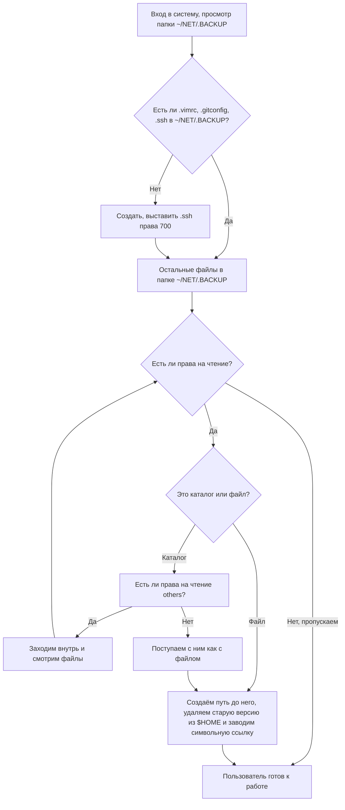

=== FEATURES/net-backup.service ===

# net-backup.service
Сервис создаёт символьные ссылки на содержимое каталога /home/artos/NET/.BACKUP.
Дерево .BACKUP/ при линковании просматривается не с глубиной 1, а целиком:
Если мы встретили что-то с правами вообще без чтения — скипаем это (если это был каталог — не заходим)
Если мы встретили файл, создаётся mkdir -p /home/artos/., и заводится симлинк
Если мы встретили каталог с правами без чтения для others — поступаем с ним как с файлом (симлинкаем в нужное место, но не заходим)
* Если файл без прав на чтение — пропускаем, если это каталог — не заходим внутрь
* Если это файл, создаётся mkdir -p $HOME/$(dirname файл) и заводится символьная ссылка
* Если это каталог с полными правами на чтение — заходим в него
* Если это каталог с правами без чтения для others, поступаем с ним как с файлом (аналогично создаётся путь до него и заводится символьная ссылка, но не заходим внутрь)

# NETBACKUP

